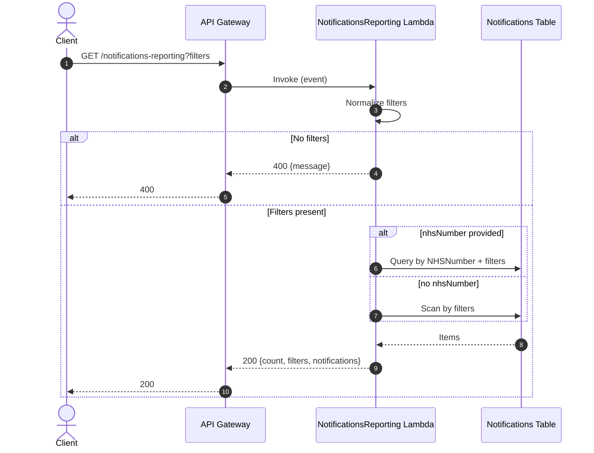

# Notifications reporting lambda

This lambda exposes a lightweight, internal reporting endpoint for notification status records stored in the notifications DynamoDB table.

## Overview

- **API path**: `GET /notifications-reporting`
- **Purpose**: return notification status records for troubleshooting and test reporting.
- **Data source**: the notifications table (`PrescriptionNotificationStatesTableName`).
- **Deployment**: controlled by the `DeployNotificationsReporting` parameter.

## Request

Query parameters (at least one is required):

- `prescriptionId` (string)
- `nhsNumber` (string)
- `odsCode` (string)

Notes:

- `odsCode` is upper‑cased before querying.
- If `nhsNumber` is provided, the lambda performs a **query** by partition key and applies additional filters.
- If only `prescriptionId` and/or `odsCode` are provided, the lambda performs a **scan** using those filters.

### Example

```
GET /notifications-reporting?nhsNumber=9999999999&odsCode=A12345
```

## Response

Success (200):

```json
{
  "count": 2,
  "filters": {
    "prescriptionId": null,
    "odsCode": "A12345",
    "nhsNumberProvided": true
  },
  "notifications": [
    {
      "NHSNumber": "9999999999",
      "ODSCode": "A12345",
      "RequestId": "req-1",
      "PrescriptionID": "RX123",
      "LastNotifiedPrescriptionStatus": "DELIVERED",
      "LastNotificationRequestTimestamp": "2025-01-01T10:00:00.000Z",
      "ExpiryTime": 1735735200,
      "NotifyMessageReference": "ref-1",
      "MessageStatus": "delivered",
      "SupplierStatus": "delivered"
    }
  ]
}
```

Error responses:

- **400** when no filters are provided.
- **500** for unexpected failures reading DynamoDB.

## Data flow


