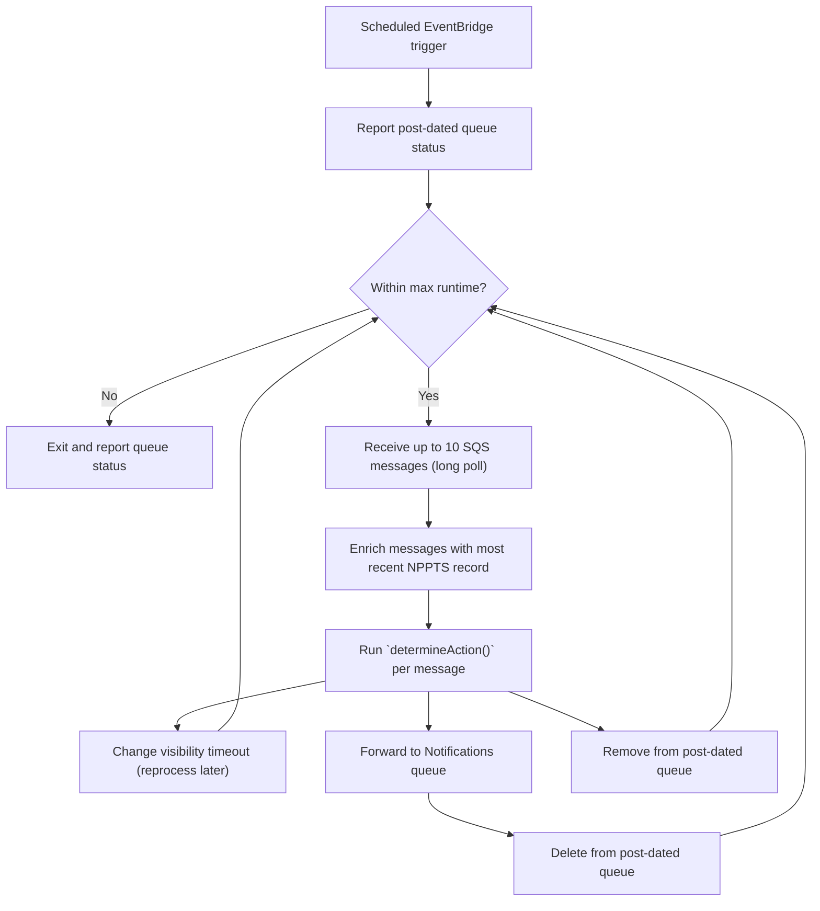
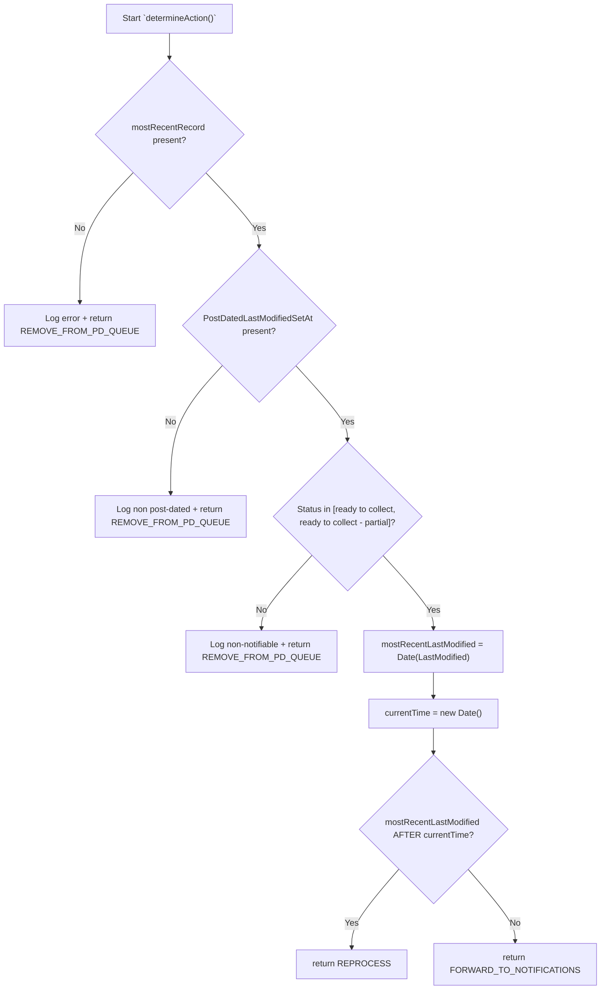

This is the business logic used for checking if a prescription ID has matured or not. It needs to tolerate a mixture of post-dated, and contemporary prescription updates; e.g. "ready to collect", post-dated, followed by "with pharmacy" non-post-dated.

The lambda drains the post-dated SQS queue in batches and handles each message based on the result of `determineAction()`. Immature prescriptions will be re-processed after some delay by changing their visibility timeout. Some prescriptions may no longer need to be considered (e.g. if there has been a subsequent PSU request marking it as "with pharmacy" again), so are deleted from the post-dated SQS without being forwarded to the notifications SQS. Mature prescriptions are forwarded to the notifications SQS.

The `determineAction()` function accepts the SQS message for this prescription ID, enriched with the most recent NPPTS record for this prescription ID. It checks whether that record is post-dated and still in a notifiable status, then compares `LastModified` (i.e. the time that a post-dated update will transition) to the current time to determine whether the update is still immature or has matured. The decision of if a notification needs to be sent to this patient is handled by the notifications lambda, still.

