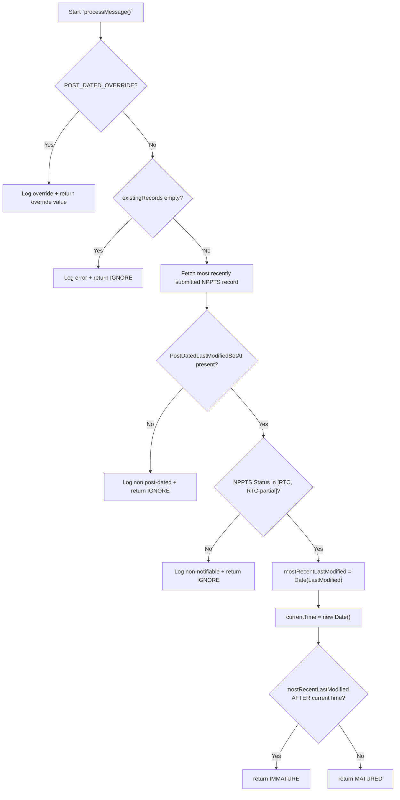
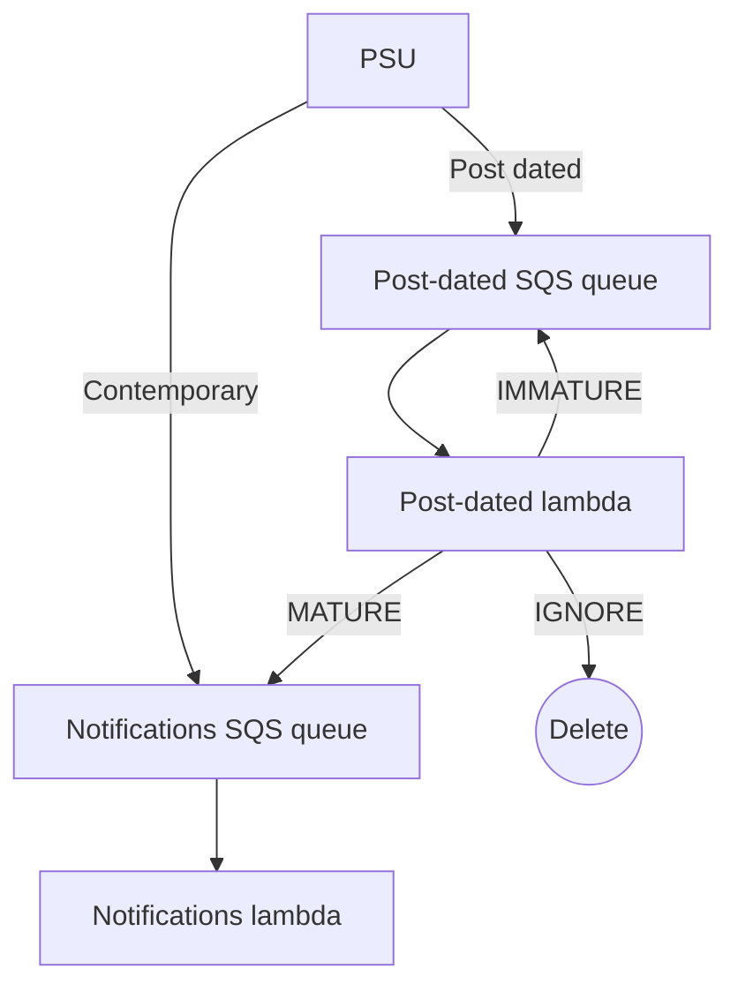

```mermaid
flowchart TD
    A["Start `processMessage()`"] --> C{"POST_DATED_OVERRIDE?"}
    C -- Yes --> D["Log override + return override value"]
    C -- No --> E{"existingRecords empty?"}
    E -- Yes --> F["Log error + return IGNORE"]
    E -- No --> G["Fetch most recently submitted NPPTS record"]
    G --> H{"PostDatedLastModifiedSetAt present?"}
    H -- No --> I["Log non post-dated + return IGNORE"]
    H -- Yes --> K{"NPPTS Status in [RTC, RTC-partial]?"}
    K -- No --> L["Log non-notifiable + return IGNORE"]
    K -- Yes --> M["mostRecentLastModified = Date(LastModified)"]
    M --> N["currentTime = new Date()"]
    N --> O{"mostRecentLastModified AFTER currentTime?"}
    O -- Yes --> P["return IMMATURE"]
    O -- No --> Q["return MATURED"]
```

```mermaid
flowchart TB
  PSU[PSU] -- "Post dated" --> Qp["Post-dated SQS queue"]
  PSU -- "Contemporary" --> Qn[Notifications SQS queue]

  Qp --> lp["Post-dated lambda"]
  Qn --> ln["Notifications lambda"]

  lp -- MATURE --> Qn
  lp -- IMMATURE --> Qp
  lp -- IGNORE --> X((Delete))
```
