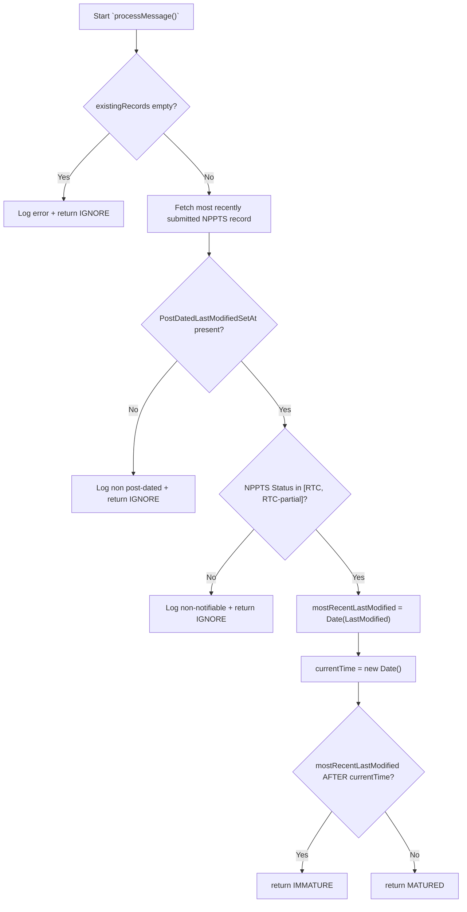
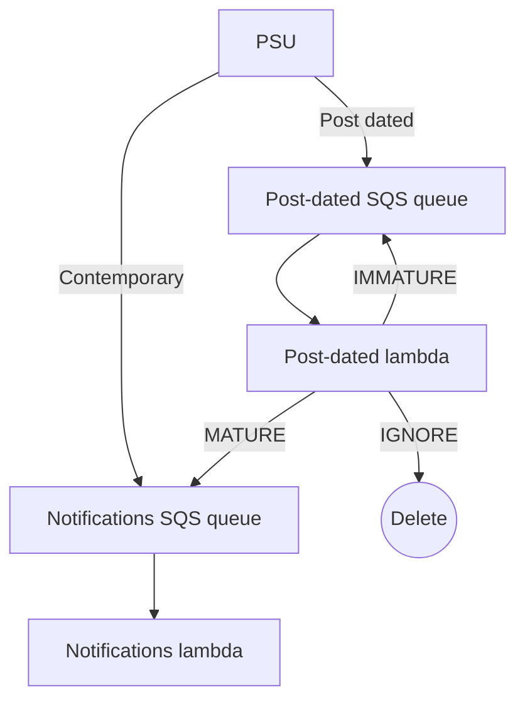

This is the business logic used for checking if a prescription ID has matured or not. It needs to tolerate a mixture of post-dated, and contemporary prescription updates; e.g. "ready to collect", post-dated, followed by "with pharmacy" non-post-dated.

The business logic's `processMessage()` function accepts the SQS message for this prescription ID, enriched with the results of querying the NPPTS data store for this prescription ID (this is the `existingRecords` attribute. Then, it inspects only the most recently submitted update for this prescription ID, and checks if it is a) actually post dated (a contemporary update may have come in since the post-dated one that triggered this SQS message), and b) has matured from "will be ready to collect" to "is now ready to collect". The decision of if a notification needs to be sent to this patient is handled by the notifications lambda, still.

Immature prescriptions will be re-processed after some delay, by being updated on SQS. Some prescriptions may no longer need to be considered (e.g. if there has been a subsequent PSU request marking it as "with pharmacy" again), so are deleted from the post-dated SQS without being forwarded to the notifications SQS. Mature prescriptions are forwarded to the notifications SQS.

